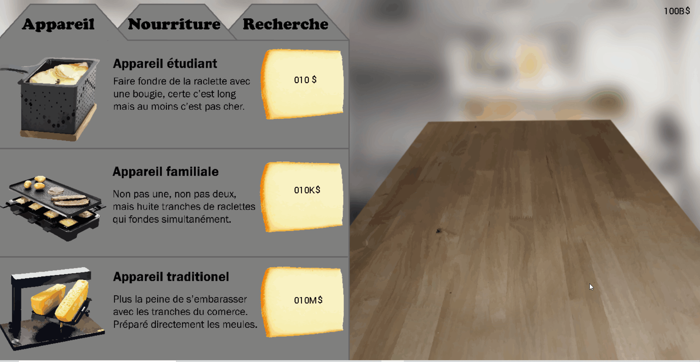
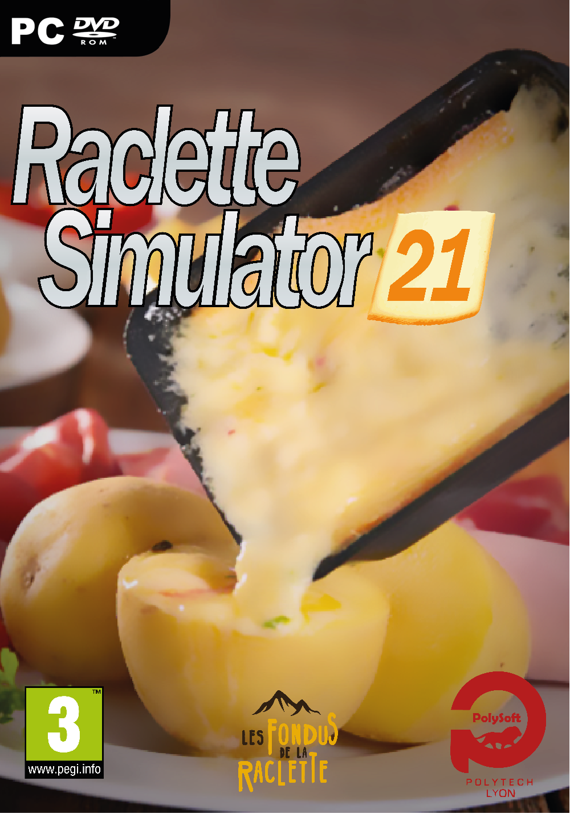

# Raclette Simulator 2021

Raclette Simulator 2021 est Ticon Clicker basé sur l'univers de la raclette. 
Il est codé en C et C++ et utilise une librairie graphique nommé Grapic.

## Jeu

## Jaquette
